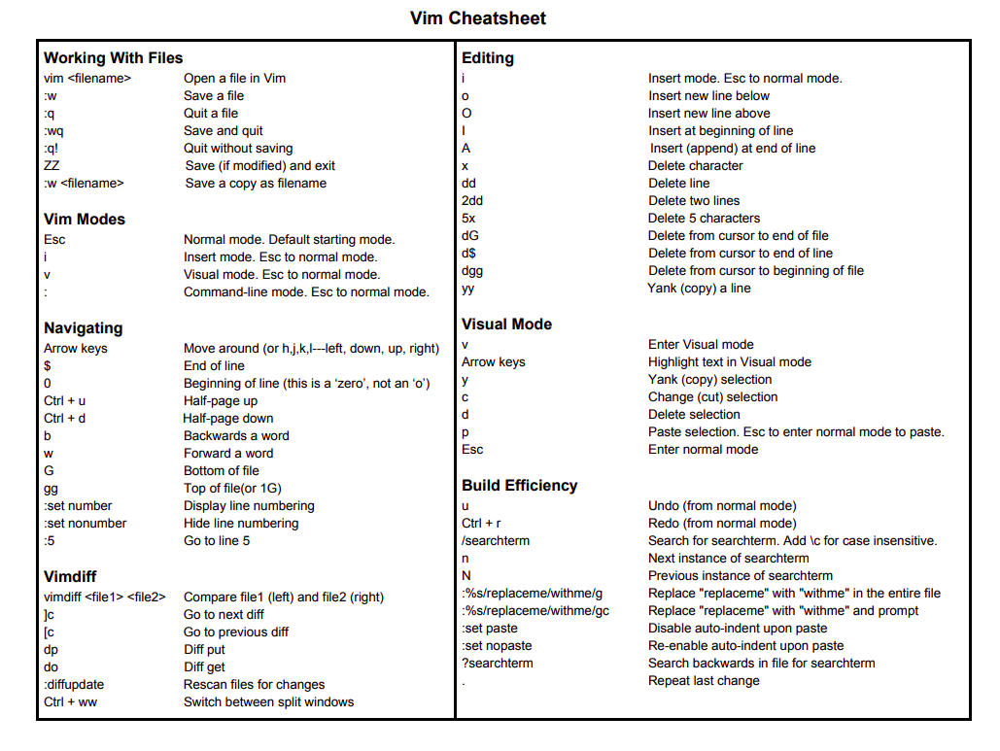

# vim-basics

## What is VIM?
vim is "Vi improved"

## What is Vi?
    -   First Full-screen text editor written for Unix
    -   Designed to be small and simple


#### Vim has more Features than Vi 
    - Multi level undo/redo
    - Extensible with plugins
    - Can run in GUI
    - Support for programming languages and file formats


```
    ## TO show Diff between Vim and Vi ##

    :h vi-differences

```

#### Vim Modes
Vim has 12 different editing modes, 6 of which are variants of the 6 basic modes.[34] The most important modes are:

 ```
  ## to list all modes info ##
  :h vim-modes
```
1. #### <b>Normal mode</b> :–
    - used for editor commands. This is also the default mode, unless the insertmode option is specified.
    ```
        press ESC from other modes to enter normal mode
    ```
    - Generally used for reading a file
    - Accepts "invisible Commands"

2. #### <b>Visual mode </b>  :– 
    - similar to normal mode, but used to highlight areas of text. Normal commands can be run on the highlighted area, for instance to move or edit a selection.
    ```
        Enter Visual mode with v from Normal mode.

    ```

    - Used for Applying commands on selection of text.
    - Similar to clicking amd dragging with a mouse to highlight text.
    - ESC to Normal mode. 

3. #### <b>Insert mode </b> :– 
    - similar to editing in most modern editors. In this mode, buffers can be modified with the text inserted.
    ```
        Press i to enter insert mode 
    ```
    - Used to edit text normally in this mode. 
    - ESC to Normal mode. 
    
4. #### <b>Command-line or Cmdline mode </b> :– 
    - supports a single line input at the bottom of the Vim window. Normal commands (beginning with :), and some other keys for specific actions (including pattern search and the filter command) activate this mode. On completion of the command, Vim returns to the previous mode.
    ```
        Press : to enter Command-line mode from normal mode

    ```
   - USed to modify settings, save or quit the file.
   - Perform search or replace pr help.
   -  ESC to normal mode. 


#### Example of usage:


1. Open a file with vim
    ``` vim fileName.extension ```
2. Quit file
    ```
        Press : to enter Command-line mode.
        Press q to Quit

    ```
3. To insert 
    ```
        Press i to enter insert modes

    ```
4. quit a file without saving
    ``` Press :q! ```

